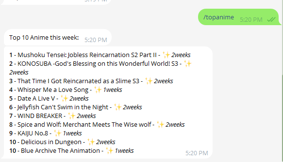

# topanime-tg-bot

View seasonal weekly anime charts, news, articles and more in your Telegram chat.

## Features

## Startup

1. Rename `.env.example` to `.env`, replace values of `BOT_TOKEN` and `USER_CHAT_ID`  to yours.

If you want to use bot in group, you need to get your group chatid.

2. Rename `topAnime.json.example` to `topAnime.json`, put it under `data` folder in root directory, be aware this file is ignored by git by default.

3. Run `npm install` to install dependencies.

4. Run `npm run dev` to start the bot in development mode. 

### How to create a Telegram chatbot yourself?

Add [Bot Father](https://telegram.me/BotFather) to your contact, use `/newbot` command to create your own bot. You will get your HTTP api token as `BOT_TOKEN` eventually.

### How to get my own chatid?

* Fastest way: Add [Get My ID](https://t.me/getmyid_bot) to your contact, use `/start` command and you will get your current chatid as your `USER_CHAT_ID`.

* Conventional way: Visit [Telegram Web](https://web.telegram.org/), open Saved Messages chat window, the number behind `web.telegram.org/a/#` is your user chatid, sometimes it is a negative figure.
(You can also appy this approach to get your group channel chatid, etc.)

## Commands Preset

* `/start` Welcome text
* `/help` Show help text
* `/settings` Open settings
* `/topanime` Get [TOP 10 anime](https://www.anitrendz.com/charts/top-anime) and send to your chat. 
* `/about` Show information about the bot
